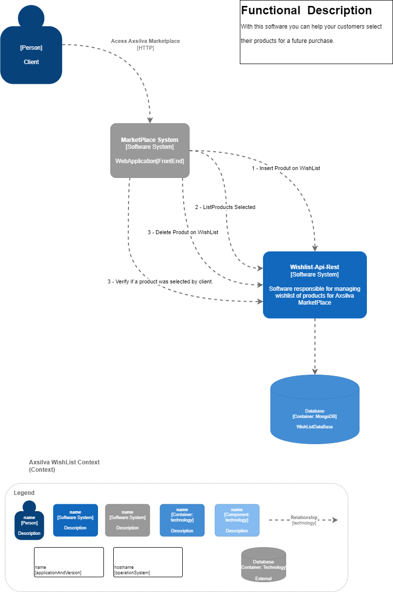

# Wishlist-api-rest

<p>
    <a href="https://github.com/axsilva1991/wishlist/actions">
        
    </a>
    <a href="https://codecov.io/github/axsilva1991/wishlist" >
        
    </a>
</p>

This is software responsible for managing wishlist of products for Axsilva MarketPlace customers.

# Frameworks

* [Some Concepts off the Clean Architecture](https://www.amazon.com.br/Clean-Architecture-Craftsmans-Software-Structure/dp/0134494164)
* [Mongo DB](https://www.mongodb.com/docs/manual/tutorial/install-mongodb-community-with-docker/)
* [SpringBoot](https://docs.spring.io/spring-boot/docs/current/reference/htmlsingle/)
* [Junit for Unit Tests](https://junit.org/junit5/docs/current/user-guide/)
* [Karate Framework for integration tests](https://github.com/karatelabs/karate)
* [Open API 3.0 specification](https://swagger.io/specification/)

# Requirements for Run Application
* Docker
* Docker Compose
* Access Internet for gradlew dependency's download
* Communication port <b>8081</b> available on the computer

# Usage
## Run the app anyway
After download project with git clone command, and install all software required in your machine.
Are you able to run wish [docker-compose](https://docs.docker.com/compose/)
## Docker

### Run
```bash
$ docker-compose up --build -d
```

### Shut down
>**Atention** <br>
> Before running shutdown commands, make sure you have performed functional tests of the application.
<br>
> ```bash
> $ docker-compose down
> ```

## Test

This project use [Karate Framework](https://github.com/karatelabs/karate) to integration tests and excecute scenarios you need to start application and run commands start a integration tests image.

>**Atention** <br>
> Because it is a integration test, it's work's if you run one time! <br>
>if you need to re-execute it, it is recommended to clean the database and restart the application.<br><br>
> <b>Before running the automated tests, make sure your application is running, if necessary you can use the actuator resources.</b>
> <br>

Actuator health check
```bash
$ curl --location 'http://localhost:8081/actuator/health'
```
Response:
```javascript
{
"status": "UP"
}
```
After this part you are able to run integration tests:

### Run
```bash

$ cd ./integration-test
$ docker-compose up --build

```
After finishing the tests, this image will be interrupted.

## Documentation
### Swagger
- This project Using OpenAPI 3.0 specification if you whant to see a doc open [swagger-ui](http://localhost:8081/api-docs/swagger-ui/index.html) in your Browser

## Continuous integration

This application used [GitHub Actions](https://docs.github.com/en/actions) to inspect and improve code. Your steps are:
* Build Gradle (Build application and run unit tests)
* [Upload code to Codecov](https://codecov.io/github/axsilva1991/wishlist)
* Build Docker Machine
* Dependency Check Vulnerability's of dependencies.

### Architecture
This part represents the [C4](https://c4model.com/) model context and container diagram and can help you better understand how the service will work.
#### Context


#### Container


## Observability
- To help debug errors, all transactions in this system generate "correlation-id" returned in the header of all calls without the need to capture customer data.

```java

INFO [wishlist 66552f5f60ed62c781cf64d5a5b05541]  30300 --- [wishlist] [io-8081-exec-10] [66552f5f60ed62c781cf64d5a5b05541-81cf64d5a5b05541] b.c.a.m.wishlist.web.ProductController   : GET - /v1/wishlist/products/{clientId}
INFO [wishlist 66552f5f60ed62c781cf64d5a5b05541]  30300 --- [wishlist] [io-8081-exec-10] [66552f5f60ed62c781cf64d5a5b05541-81cf64d5a5b05541] b.c.a.m.w.i.WishListInputBoundary        : WishListUseCase.getProductBy(clientId)
INFO [wishlist 66552f5f60ed62c781cf64d5a5b05541]  30300 --- [wishlist] [io-8081-exec-10] [66552f5f60ed62c781cf64d5a5b05541-81cf64d5a5b05541] b.c.a.m.w.r.impl.WishListRepositoryImpl  : WishListRepositoryImpl.getProductBy(clientId)
```

## Contact Support
For more information, contact our technical department: <a href="mailto:matt@anderson.xavier91@gmail.">anderson.xavier91@gmail.</a>
